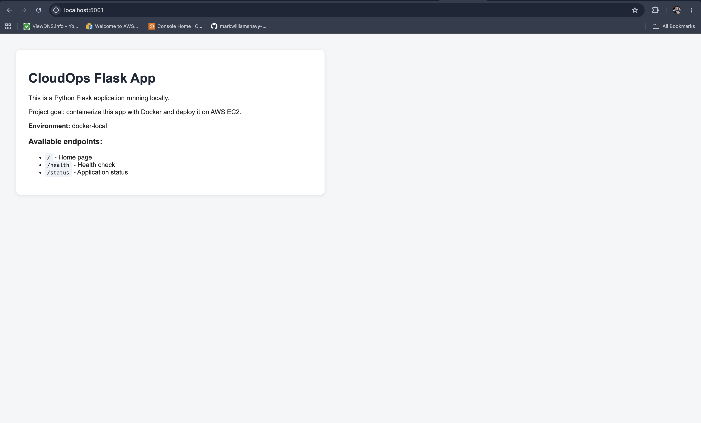
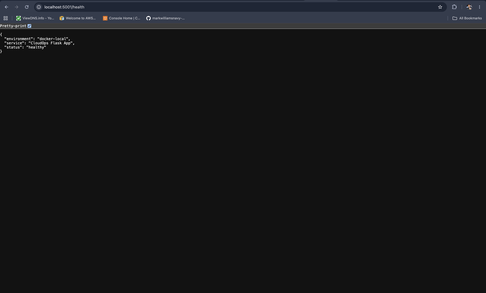
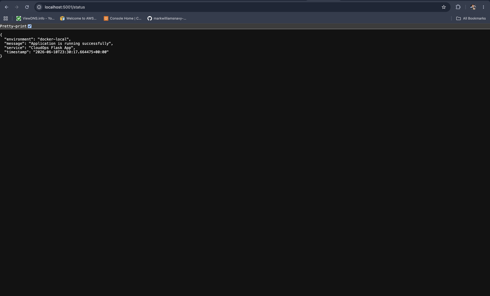
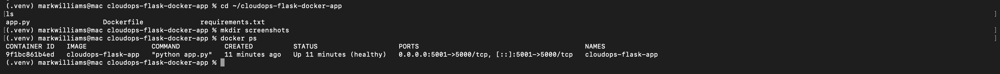

# CloudOps Flask Docker App

## Project Overview

This project is a Dockerized Python Flask application built to demonstrate containerization, application health checks, environment variables, local container testing, and deployment on an AWS EC2 instance.

The application runs with Gunicorn inside the container, exposes health and status endpoints, and is configured to run as a non-root container user.

## Technologies Used

* Python
* Flask
* Gunicorn
* Docker
* Docker health checks
* Environment variables
* AWS EC2
* Amazon Linux or Ubuntu EC2 host
* GitHub

## Application Features

* Flask home page
* `/health` endpoint for container health checks
* `/status` endpoint for application status
* Runtime configuration with environment variables
* Docker container health check
* Non-root container user
* Local and EC2 port mapping
* Container logs for troubleshooting

## Project Structure

```text
cloudops-flask-docker-app/
├── app.py
├── requirements.txt
├── Dockerfile
├── .dockerignore
├── README.md
└── screenshots/
    ├── home-page.png
    ├── health-endpoint.png
    ├── status-endpoint.png
    └── docker-healthy.png
```

## Screenshots

### Home Page



### Health Endpoint



### Status Endpoint



### Docker Health Check



## How to Run Locally Without Docker

Create and activate a virtual environment:

```bash
python3 -m venv .venv
source .venv/bin/activate
```

Install dependencies:

```bash
pip install -r requirements.txt
```

Run the application:

```bash
PORT=5001 python app.py
```

Open the app in the browser:

```text
http://localhost:5001
```

Test the endpoints:

```text
http://localhost:5001/health
http://localhost:5001/status
```

## How to Build the Docker Image

Build the image:

```bash
docker build -t cloudops-flask-app .
```

## How to Run the Docker Container Locally

Run the container:

```bash
docker run -d \
  -p 5001:5000 \
  --name cloudops-flask-app \
  -e APP_NAME="CloudOps Flask App" \
  -e ENVIRONMENT="docker-local" \
  cloudops-flask-app
```

Open the app in the browser:

```text
http://localhost:5001
```

The Docker container maps host port `5001` to container port `5000`:

```text
localhost:5001 -> container:5000
```

## Current EC2 Deployment

This app can be deployed on an AWS EC2 instance by building the Docker image on the instance or by pulling a previously published image from a registry such as Amazon ECR.

The EC2 deployment expects:

* Docker installed on the EC2 instance
* Inbound security group access to the host port used by the container, commonly TCP `80` or `5000`
* The container running with `ENVIRONMENT="ec2"`
* The EC2 public IPv4 address or public DNS name available for browser testing

Example EC2 build and run flow:

```bash
git clone <your-repository-url>
cd cloudops-flask-docker-app
docker build -t cloudops-flask-app .
docker run -d \
  -p 80:5000 \
  --name cloudops-flask-app \
  --restart unless-stopped \
  -e APP_NAME="CloudOps Flask App" \
  -e ENVIRONMENT="ec2" \
  cloudops-flask-app
```

After the container starts, open the EC2 public address:

```text
http://<ec2-public-ip>/
http://<ec2-public-ip>/health
http://<ec2-public-ip>/status
```

If the EC2 security group exposes port `5000` instead of port `80`, run the container with `-p 5000:5000` and use:

```text
http://<ec2-public-ip>:5000/
```

## Docker Commands Practiced

View running containers:

```bash
docker ps
```

View container logs:

```bash
docker logs cloudops-flask-app
```

Inspect the container:

```bash
docker inspect cloudops-flask-app
```

Stop and remove the container:

```bash
docker rm -f cloudops-flask-app
```

View local Docker images:

```bash
docker images
```

## Health Check

The Dockerfile includes a container health check that calls the `/health` endpoint on the same port the app is configured to use:

```dockerfile
HEALTHCHECK --interval=30s --timeout=5s --start-period=5s --retries=3 \
  CMD python -c "import os, urllib.request; urllib.request.urlopen(f'http://127.0.0.1:{os.getenv(\"PORT\", \"5000\")}/health', timeout=3)" || exit 1
```

When the container is running correctly, `docker ps` shows the container status as:

```text
Up ... (healthy)
```

## Runtime Configuration

The app supports these environment variables:

* `APP_NAME`: display name and service name returned by the app
* `ENVIRONMENT`: deployment environment label, such as `local`, `docker-local`, or `ec2`
* `PORT`: container port used by Gunicorn and the Docker health check, defaulting to `5000`

## Troubleshooting Notes

If local port `5000` is already in use, map a different host port to container port `5000`:

```bash
docker run -d -p 5001:5000 --name cloudops-flask-app cloudops-flask-app
```

If the app is not reachable on EC2:

* Confirm the container is running with `docker ps`
* Confirm the container is healthy
* Check logs with `docker logs cloudops-flask-app`
* Confirm the EC2 security group allows inbound traffic to the host port
* Confirm the URL uses the EC2 public IP address or public DNS name

## Skills Demonstrated

* Python Flask application development
* Gunicorn application serving
* Docker image creation
* Dockerfile configuration
* Container deployment
* Port mapping
* Environment variable usage
* Docker health checks
* Non-root container execution
* EC2 container hosting
* Container log review
* Local and cloud application troubleshooting

## Next Steps

Future improvements for this project include:

* Push the Docker image to Amazon ECR
* Add an EC2 systemd unit or deployment script
* Add CloudWatch monitoring and logging
* Add HTTPS with a load balancer or reverse proxy
