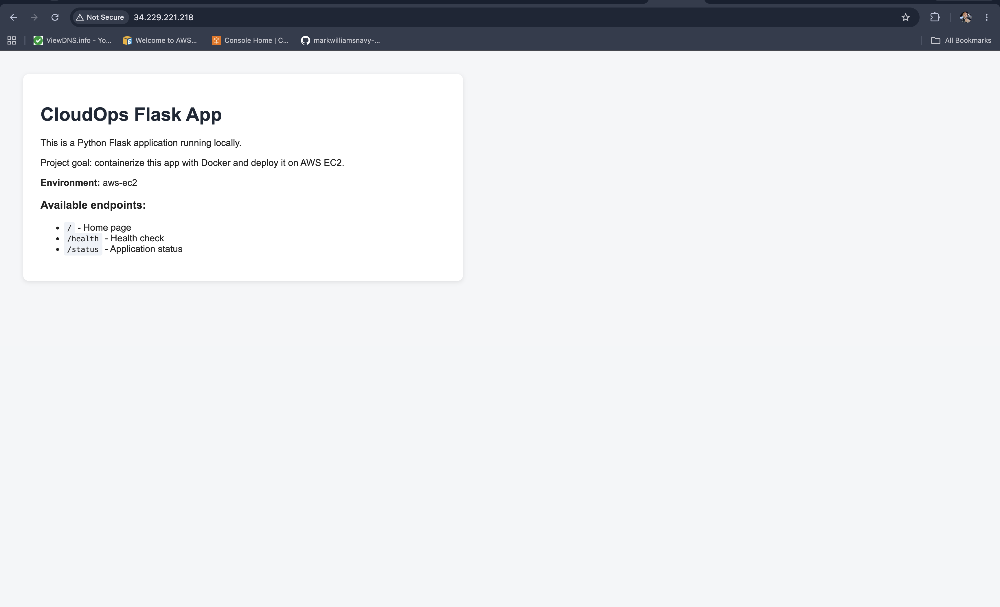
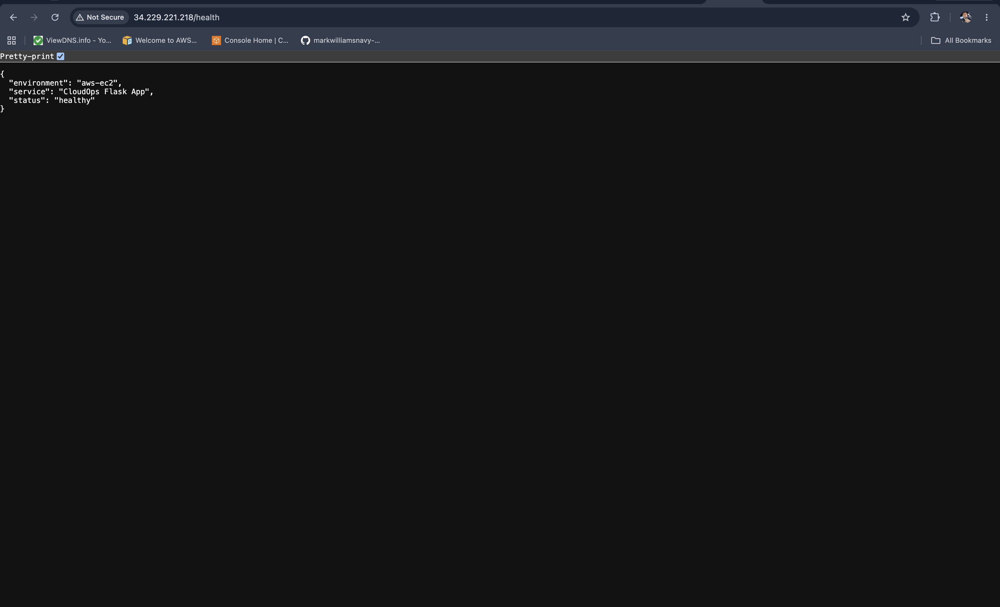
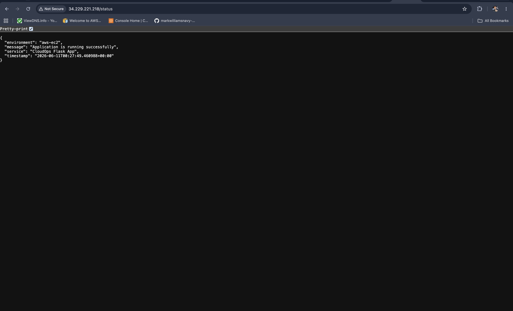
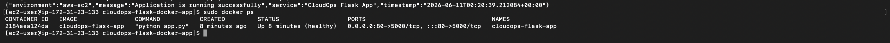
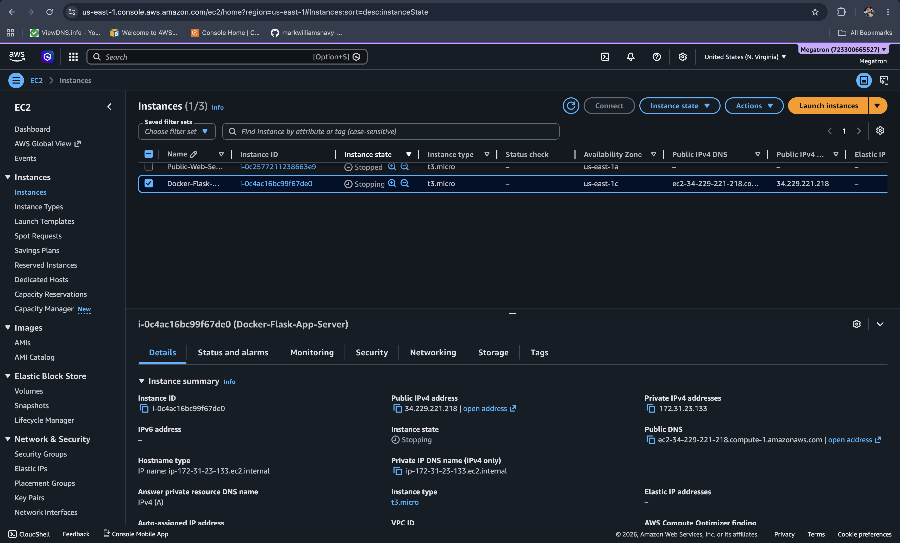
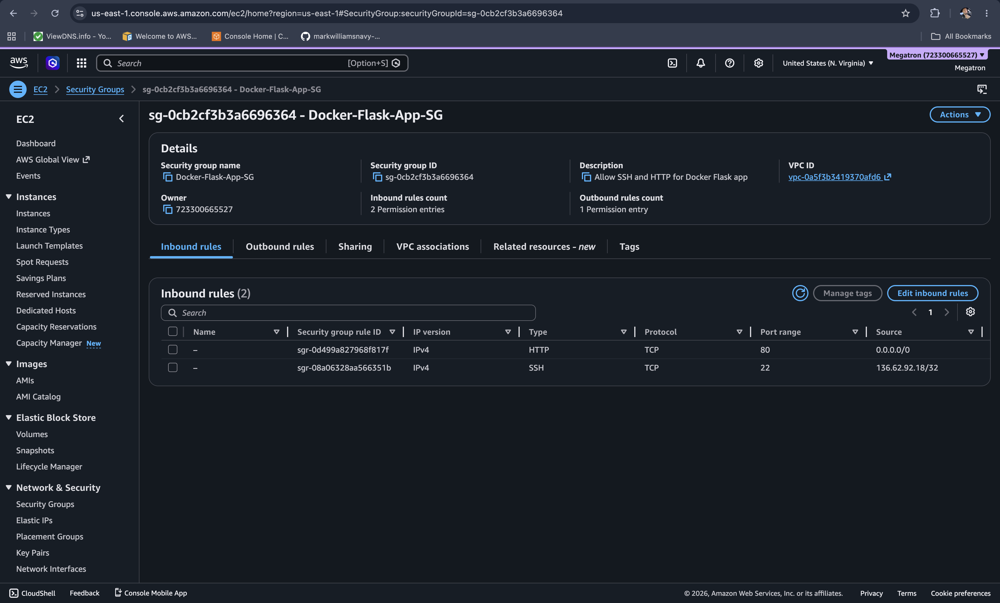

# CloudOps Flask Docker App

## Project Overview

This project is a Dockerized Python Flask application built to demonstrate containerization, application health checks, environment variables, and local container testing.

The goal of this project was to build a small cloud-ready application that can run locally in Docker and later be deployed to AWS using services such as EC2 and Amazon ECR.

## Technologies Used

* Python
* Flask
* Docker
* Dockerfile
* Docker health checks
* Environment variables
* macOS Terminal
* GitHub

## Application Features

* Flask home page
* `/health` endpoint for health checks
* `/status` endpoint for application status
* Environment variable support
* Docker container health check
* Local port mapping from host to container
* Container logs for troubleshooting

## Project Structure

```text
cloudops-flask-docker-app/
├── app.py
├── requirements.txt
├── Dockerfile
├── .dockerignore
├── README.md
└── screenshots/
    ├── home-page.png
    ├── health-endpoint.png
    ├── status-endpoint.png
    └── docker-healthy.png
```

## Screenshots

### Home Page


### Health Endpoint


### Status Endpoint


### Docker Health Check


## How to Run Locally Without Docker

Create and activate a virtual environment:

```bash
python3 -m venv .venv
source .venv/bin/activate
```

Install dependencies:

```bash
pip install -r requirements.txt
```

Run the application:

```bash
PORT=5001 python app.py
```

Open the app in the browser:

```text
http://localhost:5001
```

Test the endpoints:

```text
http://localhost:5001/health
http://localhost:5001/status
```

## How to Build the Docker Image

Build the image:

```bash
docker build -t cloudops-flask-app .
```

## How to Run the Docker Container

Run the container:

```bash
docker run -d -p 5001:5000 --name cloudops-flask-app -e APP_NAME="CloudOps Flask App" -e ENVIRONMENT="docker-local" cloudops-flask-app
```

Open the app in the browser:

```text
http://localhost:5001
```

## Docker Commands Practiced

View running containers:

```bash
docker ps
```

View container logs:

```bash
docker logs cloudops-flask-app
```

Inspect the container:

```bash
docker inspect cloudops-flask-app
```

Stop and remove the container:

```bash
docker rm -f cloudops-flask-app
```

View local Docker images:

```bash
docker images
```

## Health Check

The Dockerfile includes a container health check that calls the `/health` endpoint:

```dockerfile
HEALTHCHECK --interval=30s --timeout=5s --start-period=5s --retries=3 \
  CMD python -c "import urllib.request; urllib.request.urlopen('http://localhost:5000/health')" || exit 1
```

When the container is running correctly, `docker ps` shows the container status as:

```text
Up ... (healthy)
```

## Troubleshooting Notes

During testing, port `5000` was already in use locally, so the application was run on host port `5001`.

The Docker container maps host port `5001` to container port `5000`:

```text
localhost:5001 → container:5000
```

This helped validate port mapping and basic container troubleshooting.

## Skills Demonstrated

* Python Flask application development
* Docker image creation
* Dockerfile configuration
* Container deployment
* Port mapping
* Environment variable usage
* Docker health checks
* Container log review
* Local application troubleshooting
* GitHub documentation
## AWS EC2 Deployment

This application was also deployed on an AWS EC2 instance to demonstrate running a Dockerized Flask application in a cloud environment.

The EC2 deployment used Amazon Linux 2023, Docker, Git, security group rules, and public HTTP access through port `80`.

## AWS Deployment Steps

1. Launched an Amazon Linux 2023 EC2 instance.
2. Configured a security group to allow:

   * SSH on port `22` from my IP address
   * HTTP on port `80` from the internet
3. Installed Docker and Git on the EC2 instance.
4. Cloned this GitHub repository onto the EC2 instance.
5. Built the Docker image on EC2.
6. Ran the Flask container with port mapping from EC2 port `80` to container port `5000`.
7. Passed environment variables into the running container.
8. Verified the application through the EC2 public IPv4 address.
9. Tested the `/health` and `/status` endpoints.
10. Confirmed the Docker container showed a healthy status.

## AWS Deployment Commands

Install Docker and Git:

```bash
sudo dnf update -y
sudo dnf install -y docker git
sudo systemctl enable docker
sudo systemctl start docker
```

Clone the repository:

```bash
git clone https://github.com/markwilliamsnavy-cyber/cloudops-flask-docker-app.git
cd cloudops-flask-docker-app
```

Build the Docker image:

```bash
sudo docker build -t cloudops-flask-app .
```

Run the Docker container on EC2:

```bash
sudo docker run -d -p 80:5000 --name cloudops-flask-app \
-e APP_NAME="CloudOps Flask App" \
-e ENVIRONMENT="aws-ec2" \
cloudops-flask-app
```

Check the running container:

```bash
sudo docker ps
```

Test locally from EC2:

```bash
curl http://localhost
curl http://localhost/health
curl http://localhost/status
```

## AWS Deployment Screenshots

### AWS EC2 Home Page



### AWS Health Endpoint



### AWS Status Endpoint



### Docker Container Healthy on EC2



### EC2 Instance Details



### Security Group Rules



## AWS Skills Demonstrated

* EC2 instance deployment
* Amazon Linux 2023 administration
* SSH access with key pairs
* Docker installation on Linux
* GitHub repository cloning on EC2
* Docker image build on EC2
* Container deployment on AWS
* Port mapping from EC2 port `80` to container port `5000`
* Security group configuration
* Public HTTP access validation
* Health endpoint testing
* Container troubleshooting

## Next Steps

Future improvements for this project include:

* Push the Docker image to Amazon ECR
* Deploy the containerized application on AWS EC2
* Configure EC2 security groups for HTTP access
* Add CloudWatch monitoring and logging
* Document the AWS deployment process
